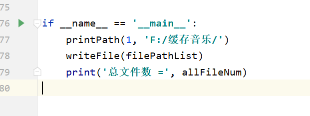
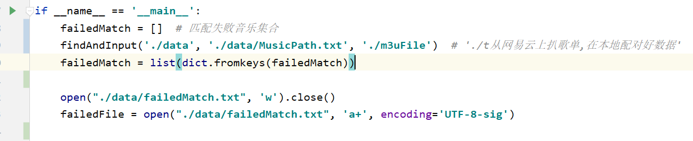

# replite 天下苦网易云音乐久已!!!!
(从网易云上扒歌单,在本地配对好数据,生成本地歌单m3u文件
## 第一步获取歌单
   懒得写了脚本了, 使用别人的项目即可(电脑亲自使用过,可行!)
[按照这个教程先导出歌单](https://github.com/c4rO-0/TampermonkeyScript/tree/master/Mexporter)
## 第二步匹配本地数据
#### 1. __init__.py: 扫描本地文件生成MusicPath.txt数据 (自定义好扫描的目录)
    插一句,生成的MusicPath.txt 只是扫描出来的,不存在同名音乐只保存一个,后续配比歌单的时候,优先选择同名文件最大的

#### 2. execute.py: 执行数据匹配,生成m3u文件
**findAndInput('./data', './data/MusicPath.txt', './m3uFile')**

**\./data : 从网易云拔下来的歌单存放地**

**\./data/MusicPath.txt : 本地配对上的所有音乐**

**\./m3uFile : 生成m3u文件存放地**

#### 3. Dopamine.exe 推荐使用本地歌单的m3u文件

**点击导入生成的歌单即可聆听**

